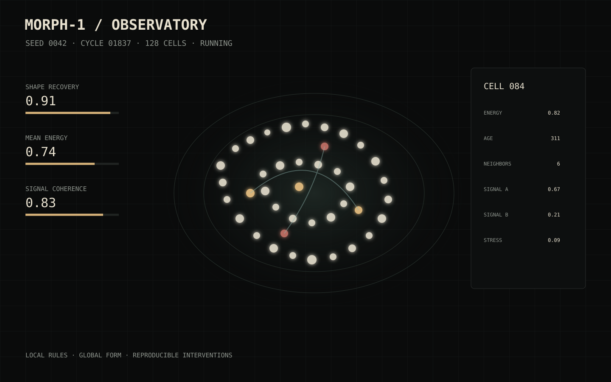
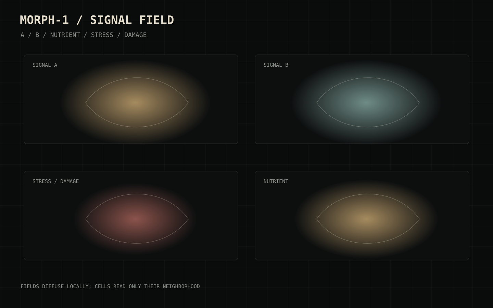

<p align="center"></p>

# MORPH-1

### 128 cells. No brain. One body.

**A transparent artificial morphogenesis laboratory for studying how local software-cell rules respond to damage, positional-signal loss and resource stress.**

MORPH-1 begins with 128 cells inside a bounded two-dimensional body. Each cell receives only local neighbour geometry, engineered scalar signals, energy, stress and its own target memory. Cut tissue away, silence a signal, inject noise or split the organism, then observe how the same local update rules attempt to stabilize the body.

> **Status:** experimental software model, version 0.1.0. MORPH-1 is not a biological tissue simulation, medical model, developmental-biology claim, or reconstruction of a real organism. Its rules and parameters are engineered for inspectability.



[Quick start](docs/QUICKSTART.md) · [Methods](docs/METHODS.md) · [Experiments](docs/EXPERIMENTS.md) · [Results](docs/RESULTS.md) · [Architecture](docs/ARCHITECTURE.md) · [Limitations](docs/LIMITATIONS.md)

## Open the laboratory

Download or clone the repository, then double-click **`MORPH-1.html`**. The committed offline entry uses the repository's local CSS and JavaScript files, so it needs no package installation, account, API key or network request. Run `npm run build` to assemble those same sources into a single-file standalone `MORPH-1.html`.

For source development with Node.js 20 or later:

```bash
npm start
```

Then open `http://127.0.0.1:4173`.

## The feedback loop

```text
local positional + nutrient inputs
              ↓
       cell energy / stress
              ↓
 neighbour mechanics + repair guidance
              ↓
         movement / division
              ↓
       changed local geometry
              ↓
           next cycle
```

The visual body is not an independent animation. Cell positions, contacts, births, stress colours and signal fields are drawn from simulation state.

## Six working views

| View | Purpose |
| --- | --- |
| **Observatory** | Run, pause, step and inspect living cells. |
| **Signal field** | Visualize engineered A/B positional gradients and center signal. |
| **Cell atlas** | Inspect the current near-neighbour graph. |
| **Intervention lab** | Remove tissue manually or apply fixed perturbations. |
| **Experiments** | Execute matched protocols from a deterministic seed. |
| **Run archive** | Save and export seed, cycle and intervention history. |

## Fixed experiment set

| Protocol | Intervention | Question |
| --- | --- | --- |
| `M-01` | none | Does the body remain stable? |
| `M-02` | left incision | Can motion and division restore tissue? |
| `M-03` | morphogen A disabled | How dependent is shape on positional information? |
| `M-04` | nutrient field reduced | What changes when growth is resource constrained? |
| `M-05` | A/B polarity swapped | What happens when signals disagree with target memory? |
| `M-06` | repair guidance replaced by random motion | How much stability comes from the engineered repair rule? |
| `M-07` | 35% signal noise | How robust is the system to noisy positional information? |
| `M-08` | central split | Does the body reconnect after separation? |

## Reproduce the reference series

The benchmark executes eight protocols across six deterministic seeds (48 runs total):

```bash
npm run benchmark
```

It writes `data/benchmarks/reference.json`. `docs/RESULTS.md` explains how to interpret the metrics and why they should not be generalized to living tissue.



## Build and verify

```bash
npm test
npm run benchmark
npm run build
npm run verify
```

`npm run build` assembles a single-file standalone `MORPH-1.html` from the source application. The runtime itself has no third-party dependencies.

## Repository map

```text
morph-1/
├── MORPH-1.html          # offline laboratory entry; build can bundle it
├── index.html            # source application entry
├── styles.css
├── src/
│   ├── core/             # cells, fields, mechanics, interventions, metrics
│   ├── experiments/      # fixed protocol definitions
│   └── ui/               # renderer and controls
├── data/benchmarks/      # executed reference series
├── assets/               # mark and computed model figures
├── scripts/              # server, benchmark, build and verification
├── tests/                # deterministic checks
├── docs/                 # methods, interpretation and developer notes
└── .github/              # CI and issue template
```

## Model boundary

The cells are software agents. The morphogens are engineered scalar fields. Target memory is an explicit state variable. Mechanical interactions are simplified pairwise rules. Recovery is a software metric combining cell count, target coverage and centroid stability. See [Model card](docs/MODEL_CARD.md) and [Limitations](docs/LIMITATIONS.md).

## License

Code, documentation and original visual assets are released under the MIT License.
